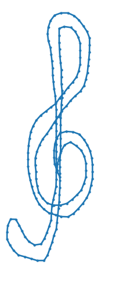
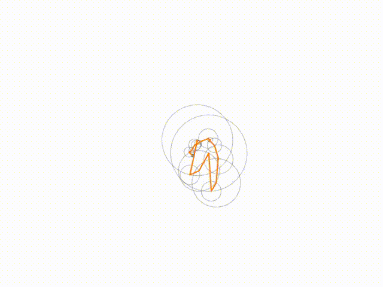

# Fourrier wonder

This repository originally aims at reproducing visualisation from [3Blue1Brown channel](https://www.youtube.com/watch?v=-qgreAUpPwM). The result is far from being as mesmerizing as the animations shown on this video, all the animation being made through the notebook: Everything is written in python.

Meaning, from an arbitrary line

 

find the Fourrier coefficients such that the Fourrier partial sum made from these coefficients approximate the line.

.

Because the notebook contains animation, it cannot be rendered within github. You can play with it on .

* The notebook `full_notebook` shows all the code necessary for this task.
* The notebook `demo` import all these code so that only the main steps are shown.

The main steps of full_notebook are

## 1. Animating a fourrier series

The first part of the notebook creates a `FourrierCurve` object. This is mostly a dictionnary {frequency: complex coefficient}. 
It computes the trajectory of this serie within the complex plan.
This enables us to draw or animate the drawing.

## 2. Reverse

This part aims at finding fourrier coefficient for an arbitrary (looped) curve. The object `polygon` takes a list of coordinates and can export a `FourrierCurve`.

## 3. Custom drawing

This part is a cell utility, that enables the user to draw an arbitrary line. 
To start drawing you need to click, then draw with your mouse, and click again to stop.
You can then find the `FourrierCurve` fitting your drawing.
Some drawings of my own are available in "/drawings/" for illustration purpose

## Environment

export env with `conda env export --no-builds -f environment.yml` and manually prune
windows specific packages (for mybinder)

create gif from mp4 with `ffmpeg -i sol_key.mp4 -f sol_key.gif`

